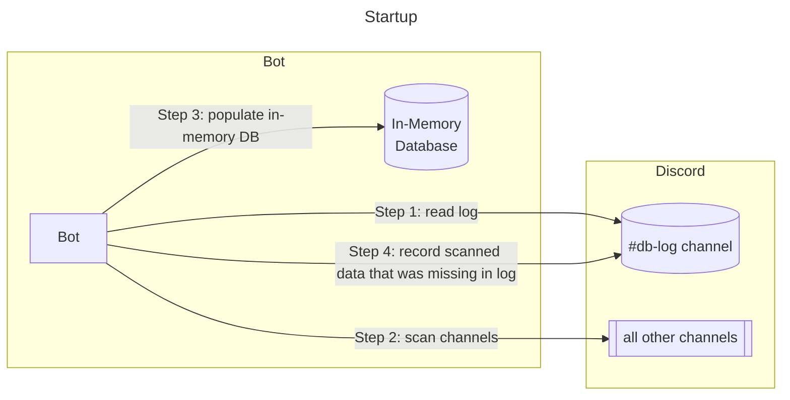
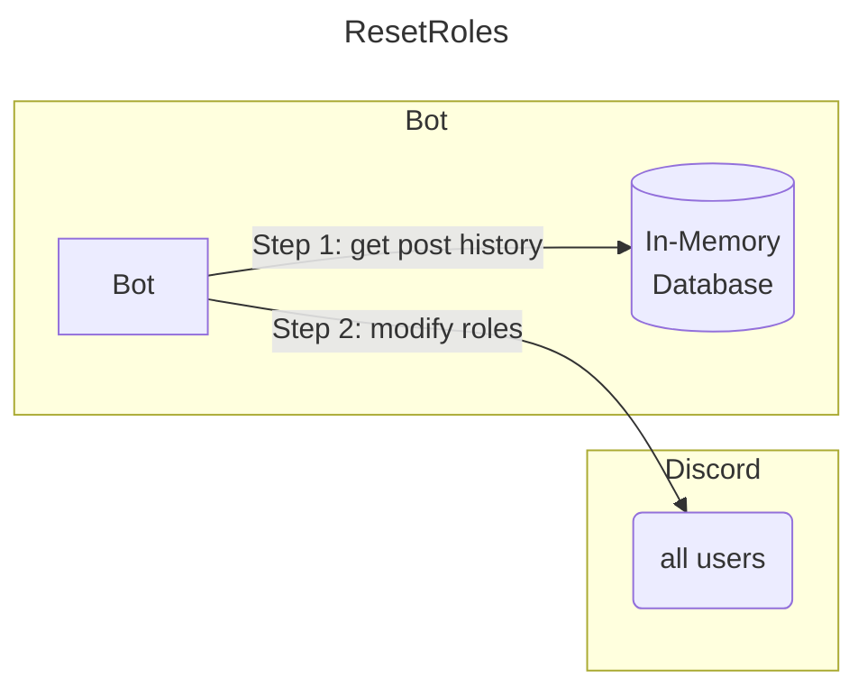
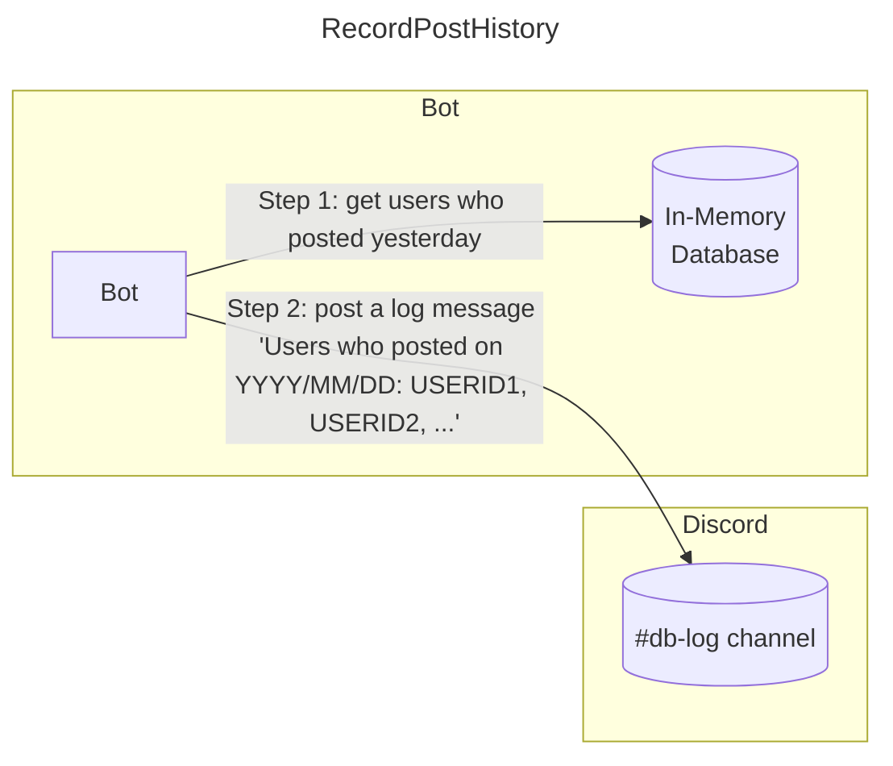
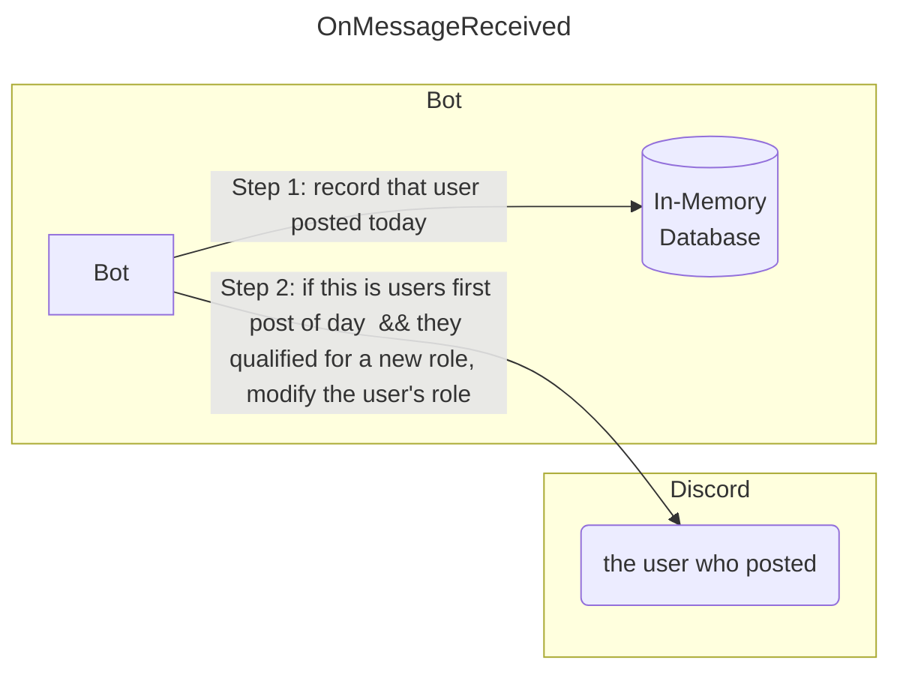
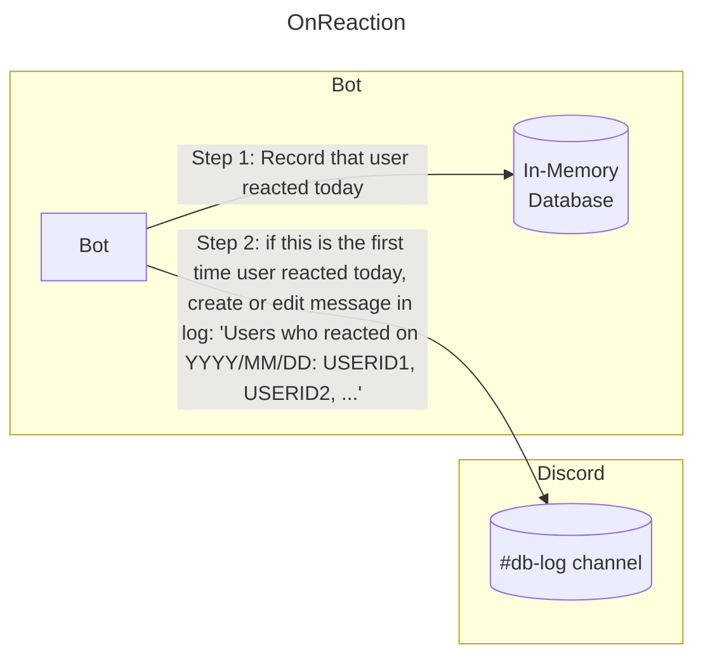

# Database Design

## Overview
The database for this bot is split into two components:

#### In-Memory DB
The bot does all its work through the in-memory database. The in-memory db is a collection of which users posted on which days, and which users reacted on which days. If the number of users who regularly post and/or react is on the order of tens of thousands or less, this in-memory db requires a negligible amount of RAM.

#### Persistence Channel
The persistence layer is a special discord channel which the in-memory database is persisted to. It has two primary functions.

First, by persisting the in-memory database in the persistence channel, the bot has to do far less scanning on startup. Instead of scanning the back to the beginning of relevant history, the bot can merely scan what isn't already recorded in the persistence channel.

Second, the persistence channel enables two features which could not be achieved through an in-memory database alone:
1. Using reactions as part of users' tracked activity. Since the discord REST API does not include timestamps for when reactions occurred, the only way we can know when reactions occurred is by tracking reaction events while the bot is up and running. Reaction timestamps must be persisted while the bot is running, otherwise, when the bot is restarted, we will not be able to re-discover when users reacted.
2. Enabling disappearing messages. In the disappearing messages feature, old messages are deleted. If we delete old messages and restart the bot, the bot has no way to know the users' post history during deleted time periods except through a persisted record.

## Rationale for this design
This database does not require any DB hosting costs, because the data is persisted in discord itself, in a special channel. This allows our discord server to stay free.

This discord bot has no external dependencies except on discord itself, which means other groups can use this bot with little-to-no software experience.

The in-memory database is lightning fast and requires very little RAM for realistic levels of discord activity.

The persisted data can be owned, visible, and shared by all discord admins (because it's a discord channel).

Any transfers of admin power are trivial: it's super easy to host the bot by simply running a JAR program on a laptop, computer, or server. No DB knowledge is required for future admins of the discord server.

## Design Diagrams

#### Startup

Note: Steps 2 & 4 only includes scanning & recording missing **post** data, not missing **reaction** data. Reaction timestamps are not available through the discord REST API. Reaction timestamps can only be computed from websocket events. The only way we can know _when_ a user reacted is through the OnReaction handler below. Therefore, **if the bot is offline or restarting, a user who reacts will not have their reaction recorded.**

#### ResetRoles
Run on startup and at 12:05am UTC every day

## RecordPostHistory
Runs once per day, after ResetRoles runs

## OnMessageReceived

## OnReaction
