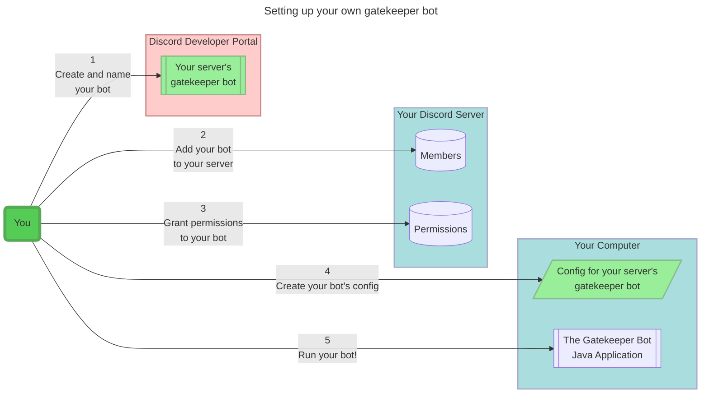

# Gatekeeper Bot

This bot grants and removes roles from discord community members based on their activity.

Currently, this bot only monitors posts, but we are adding support for reactions too.

## Using this discord bot

For now, this bot is only capable of managing roles for a single server.

You must register your own bot with discord to use this code. It's doable and only requires following instructions, but it takes a little bit of time.

After following the instructions, you will be able to run the gatekeeper bot application to give life to your bot, and start managing your server's membership roles.

To run the application, you will need to install `Java Runtime Environment` version 17 or higher on your computer, laptop, or server (wherever you'd like to run the application from).

### Overview

Here's an overview of the steps required to create your own bot which manages membership roles on your server.

### Instructions

1. Create and name your bot
   - Create and register your own bot in the discord developer portal. 
   - Directions are bountiful on the internet. Please feel free to ask if you need help. We can link to some instructions or add our own.
   - When you create your bot, you can name it whatever you want. We called ours "Gatekeeper Bot".
2. Add your new bot to your server
   - You can use the url discord provides in the developer portal. There should be ample instructions online, but please ask if you need help!
3. Grant permissions to your bot
   - `Add` your bot to every room you want it to monitor activity in.
   - Grant your bot permission to `manage roles`.
   - Grant your bot permission to `manage threads`. The `manage threads` permission is required for the bot to read through archived threads when it starts up for the first time.
   - `Add` your bot to whatever rooms you'd like it to post messages in.
     - And make sure you bot has permission to `send messages` in these rooms.
     - In [our server's config][config], you can see that we have our bot post a "welcome message" in a relevant room when a participant is granted a membership role.
     - Our bot also posts a "downgrade message" in a moderator-only room whenever a member's inactivity lead to them having a lower priority role than they had before.
4. Create your bot's config
   - Create a copy of [our server's config][config].
   - Edit the config such that it references to your server, your roles, and your channels.
   - Ask us if you have any questions!
5. Run your bot!
   - Install `Java Runtime Environment` version 17 or higher
   - Create & copy your bot's access token in the discord developer portal. Save it somewhere safe. 
   - Open a shell prompt and create an environment variable named `DISCORD_API_TOKEN` with the value of your bot's access token.
   - Download the [latest version of the gatekeeper-bot-application](https://github.com/regenerativeag/releases/tree/main/gatekeeper-bot)
   - Run the gatekeeper bot application to give life to your bot!
     - windows: `java.exe -jar gatekeeper-bot-application-1.0.0.jar path/to/your/config.yml --dry-run=true`
     - linux/mac: `java -jar gatekeeper-bot-application-1.0.0.jar path/to/your/config.yml --dry-run=true`
     - Replace `1.0.0` with whatever version of the application you downloaded.
     - When you start the application, it will run in "dry-run" (testing) mode, meaning your bot will not edit any roles or post any messages to any channels. It will simply run and print what it would have done.
     - When you are ready to run the application in production mode, where it actually edits roles and posts messages, change the `--dry-run=` flag from `true` to `false`
   - Alternatively, you can build the application from the source code
     - Clone this repository using Git, or simply download the whole repository as a file here on GitHub.
     - Build the application:
       - windows: `gradlew.bat build`
       - linux/mac: `./gradlew build`
     - Find the built jar at `gatekeeper-bot/build/libs/gatekeeper-bot-VERSION-all.jar` and follow the instructions above!

[config]: bot-config.yml